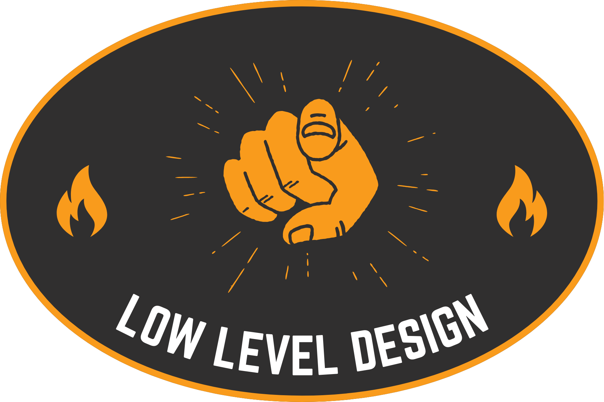

  

This is a repository that I'm currently working on to **learn** and **create useful resources** for **LLD (Low-Level Design)** and **OOD (Object-Oriented Design)** to help with **interview preparation** and **real-world system design**.

---

## What is LLD?

> Low-Level Design (LLD) is all about how your code is actually structured behind the scenes.
> You take the big idea (high-level design) and break it into small pieces — like classes, objects, and how they interact.
>
> It's where you use things like OOP, design principles, and design patterns to plan how features will be coded before you even start writing the code.
>
> Think of it as creating the **blueprint for your code** to make sure it's clean, reusable, and easy to maintain.

---

## Fundamental Concepts in LLD

- **OOP**

  - [🔗 Basic Principles of OOP (Object-Oriented Programming)](https://dev.to/ahadalireach/basic-principles-of-object-oriented-programming-oop-544l)
  - [🔗 OOP Concepts + 150+ Interview Questions (GitHub Repo)](https://github.com/ahadalireach/oop.concepts.interview.questions)

- **Design Principles** _(currently learning)_
- **UML (Unified Modeling Language)**
- **Design Patterns**
- **Case Studies & Practice Problems** _(coming soon)_

> 📌 _This content will be continuously updated as I learn and explore more._

---

## Contributing

Contributions are welcome! If you'd like to add a new problem, improve existing content, or fix errors:

1. Fork the repository
2. Create a feature branch: `git checkout -b feature/your-feature-name`
3. Commit your changes: `git commit -m 'Add some feature'`
4. Push to the branch: `git push origin feature/your-feature-name`
5. Submit a pull request 🚀

Please make sure to update README files and documentation as appropriate.

For questions, feedback, or collaboration opportunities, feel free to reach out:

📧 **ahadali.reach@gmail.com**

---

  <i>If you find this resource helpful, please give it a ⭐️ and share it with others!</i>

